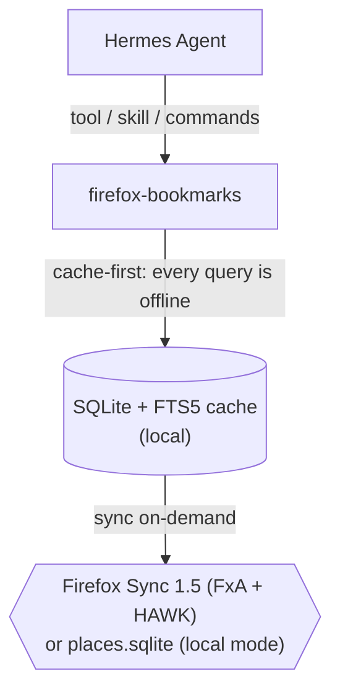

# hermes-plugin-firefox-bookmarks

Plugin for [Hermes Agent](https://hermes-agent.nousresearch.com) that reads, searches and analyzes your **Firefox bookmarks** — from the **Firefox Sync** cloud (Sync 1.5, end-to-end encrypted) or from a local profile (`places.sqlite`), with no Firefox installed on the machine. **v1 is read-only**: it never modifies bookmarks on the server.



## Features

- **Sync**: Firefox Account login (with 2FA/TOTP), HAWK, HKDF-SHA256, AES-256-CBC+HMAC on BSOs — implemented in pure Python (`ffsync/`, zero Hermes dependencies)
- **Search**: FTS5 over titles/URLs/tags/folder structure + domain, folder, tag and time-range filters; natural queries ("did I save something about systemd?")
- **Deterministic analysis** (no LLM): counts, per-domain distribution, duplicates, orphan links (URLs without a title)
- **Opt-in link check**: concurrent HEAD (4 threads), timeout, politeness; never automatic
- **Local mode**: reads `places.sqlite` from a copy only (zero risk to the profile)
- **Skill** `firefox-bookmarks` with operating rules (short queries, consent for link-check)

## Requirements

- A recent Hermes Agent with the plugin system (user dir: `~/.hermes/plugins/` or `$HERMES_HOME/plugins/`)
- Python 3.10+ in the Hermes venv (already included in standard installs)
- Runtime: `httpx` + `cryptography` (already in the Hermes venv); dev: `pytest`

## Installation

```bash
git clone <repo-url> ~/.hermes/plugins/firefox-bookmarks
# or: unzip into ~/.hermes/plugins/
```

Activate the plugin (the gateway detects user plugins in `plugins/`):

```bash
hermes plugins list          # verify that firefox-bookmarks appears
hermes plugins doctor firefox-bookmarks
```

The plugin requires **0 privileged capabilities** and **does not override built-in tools**.

## First-time setup

> Running Hermes in Docker or headless? Skip this section — see [Running inside Docker](#running-inside-docker): email + password come from env vars.

Credentials **never pass through Telegram/LLM** (the password is used only in the FxA login; the refresh token stays on disk with `600` permissions).

**Plan A — Firefox Sync (requires a Firefox Account with Sync active):**

```bash
cd ~/.hermes/plugins/firefox-bookmarks
python -m ffsync.probe setup          # password from the terminal (getpass, never shown)
python -m ffsync.probe sync           # first sync + verification
python -m ffsync.probe status         # credentials + cache status
```

**Plan B — local profile (no account):**

```bash
python -m ffsync.probe local ~/.mozilla/firefox/<profile>/  # or a path to places.sqlite
```

## Running inside Docker

Headless deployment: **sync mode only**, no Firefox profile inside the container, no interactive setup. The Firefox Account email and password come from environment variables and are used exactly once — afterwards the saved refresh token on the volume is enough. If the account has 2FA enabled, Hermes asks you for the current code in chat during the first sync.

### Environment variables

| Variable | Required | Purpose |
|---|---|---|
| `FFB_EMAIL` | yes | Firefox Account email |
| `FFB_PASSWORD` | yes | Account password — used for the one-time login, never stored |

`HERMES_HOME` (or `FFB_HOME`) still controls where `plugin-data/` lives. Leave `FFB_MODE` unset — `sync` is the default.

### docker-compose.yml

```yaml
services:
  hermes:
    image: your-hermes-image
    env_file: .env
    environment:
      HERMES_HOME: /data/hermes
    volumes:
      - hermes-data:/data/hermes
      - ./firefox-bookmarks:/data/hermes/plugins/firefox-bookmarks:ro
volumes:
  hermes-data:
```

`.env` (never commit it; `chmod 600`):

```
FFB_EMAIL=you@example.com
FFB_PASSWORD=your-password
```

The container needs egress to `accounts.firefox.com` and the Firefox Sync storage host.

### How the bootstrap works

1. First `/bookmarks-sync` (or `firefox_bookmarks_sync`): no `creds.json` yet → the plugin logs in with `FFB_EMAIL`/`FFB_PASSWORD`, saves `refreshToken` + key material to `/data/hermes/plugin-data/firefox-bookmarks/creds.json` (`0600`), then syncs.
2. With 2FA enabled the first sync returns `TOTP_REQUIRED` — **Hermes asks you in chat for the current OTP code** and retries with it (`totp_code` argument). The code expires in ~30 s and is never stored, and it is never asked for again.
3. Later syncs reuse `creds.json`; the volume makes it survive restarts and re-creates. The TOTP is never asked for again.
4. Once logged in, drop `FFB_EMAIL`/`FFB_PASSWORD` from `.env` — a saved `creds.json` always wins over the env vars. To force a re-login, delete `creds.json` from the volume and set the env vars again.

The password is used only for the FxA login: never written to disk, never logged, never sent through chat/LLM.

### Verify

```bash
docker compose exec hermes python -m ffsync.probe status
```

## Usage

After the first sync (or with plan B), everything works from chat:

- "What did I save about systemd?" → `firefox_bookmarks_search`
- "How many bookmarks do I have, and where are most of them?" → `firefox_bookmarks_analyze`
- "Show me the folder structure" → `firefox_bookmarks_tree`
- "Check whether the links in a folder are dead" → `firefox_bookmarks_recheck` (requires consent)
- Commands: `/bookmarks-sync` (immediate refresh), `/bookmarks-report` (overview + domains + duplicates)

## Synchronization: how often?

**The plugin has no fixed cadence: sync is on-demand** (tool `firefox_bookmarks_sync`) or **schedulable** with a Hermes job.

Concrete v1 behavior:

- `firefox_bookmarks_search`/`analyze`/`tree` **never** trigger a sync: they read the local cache. If the data is older than 7 days, the response includes `hint: consider sync`.
- Sync is not incremental in v1 (full list of `bookmarks`): it is very light (<1000 records), but it is still better not to run it on every query.

Recommended cadences:

| Need | Setup |
|---|---|
| "always up to date" | job every **30 minutes** (see below) |
| daily use | job **every night** (e.g. 03:00) — the example from the development plan |
| occasional | on-demand only (`/bookmarks-sync`) |

Example job (natural language; Hermes creates the cron job):

```
every 30 minutes, if the bookmark cache is empty or older than 30 minutes,
run firefox_bookmarks_sync and do not reply if everything is fine
```

Note: every sync consumes FxA quota (Sync rate limits are per-collection;
pagination handles 429s with backoff). A job every 30 minutes is reasonable;
every 5 minutes is not.

## Testing

```bash
cd firefox-bookmarks
python -m pytest tests -q      # 13 offline tests (crypto, HAWK, parser, cache, handler)
```

## Troubleshooting

| Symptom | Cause / fix |
|---|---|
| `NOT_CONFIGURED` | Run `python -m ffsync.probe setup` |
| `SESSION_EXPIRED` | The refresh token expired: run `probe setup` again |
| `ACCOUNT_LOCKED` | Mozilla locked the account after too many attempts: wait and retry |
| `NEEDS_VERIFICATION` | The FxA account has not completed email verification: finish it on accounts.firefox.com |
| `STORAGE_ERROR 429` | Sync rate limit: already handled with backoff; avoid back-to-back syncs |
| The cache looks stale | Check `stats.last_sync` (epoch) and run `/bookmarks-sync` |

## Security

- **Read-only v1**: no writes toward the Sync server.
- The password is never stored: only `refreshToken` + `keyFetchToken` (on disk, `600`).
- Credentials never transit through logs, tool responses, or scheduled jobs — the only exception is the one-time TOTP code (a tool argument, valid ~30 s, never persisted).
- Link-check: never automatic; requires an explicit request (see the skill).
- Data: bookmarks stay end-to-end encrypted on Firefox Sync; the local cache is in plaintext on disk — if you share the machine, protect the `plugin-data/` folder.

## License

MIT — see [LICENSE](LICENSE).

